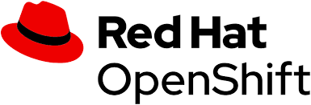

---
# try also 'default' to start simple
theme: seriph
# random image from a curated Unsplash collection by Anthony
# like them? see https://unsplash.com/collections/94734566/slidev
background: https://source.unsplash.com/collection/94734566/1920x1080
# apply any windi css classes to the current slide
class: 'text-center'
# https://sli.dev/custom/highlighters.html
highlighter: shiki
# show line numbers in code blocks
lineNumbers: false
# some information about the slides, markdown enabled
info: |
  ## Slidev Starter Template
  Presentation slides for developers.

  Learn more at [Sli.dev](https://sli.dev)
# persist drawings in exports and build
drawings:
  persist: false
# use UnoCSS
css: unocss
---

# The open source world

The open source world

  <button @click="$slidev.nav.openInEditor()" title="Open in Editor" class="text-xl icon-btn opacity-50 !border-none !hover:text-white">
    <carbon:edit />
  </button>
  <a href="https://github.com/Andrea-Canale" target="_blank" alt="GitHub"
    class="text-xl icon-btn opacity-50 !border-none !hover:text-white">
    <carbon-logo-github />
  </a>

<!--
The last comment block of each slide will be treated as slide notes. It will be visible and editable in Presenter Mode along with the slide. [Read more in the docs](https://sli.dev/guide/syntax.html#notes)
-->

---

# What is an Open Source project

An open source project is a project where the work(code, documents, blueprints or others things) is shared with all the worlds and all the people can contribute, modify or just see all the work, not only the final product.
The copyright always exists, if a piece of design is taken without reporting the original author it is an infringement.

  
  
Some open source application

---
layout: image-right
image: assets/ford.jpg
---

# History of open source

The open source project don't concerns only IT, in fact the first example of open source project was in 1911 when Henry Ford get George B. Selden gasoline engine project and modify it. Ford and Selden create a new association with all car manufacturers, in this association all can see the motor project and use or modify it for them car without paying any money.
This is not the very definition of open source that was born with the internet, however the concept is this.

---
layout: image-left
image: assets/stallman.jpg
---

# The Free Software Foundation

In the 80s some programmers at MIT can't access to printer driver source code so in protest they created associations to make free software, even refusing to work in companies that produced non-public code.
Between these, there is Richard Stallman, the creator of the most important free software fondation, GNU and FSF.

---
layout: image-right
image: assets/linus.jpg
---
# The role of internet

Internet has expanded the visibility of many projects, among them is the first completely free and open source operating system - Linux. 
Created by Linus Torvalds.
This is the first open source big project. 
Also other projects like OpenOffice try to transform closed-source project to open source with good results.
---
class: px-20
---

# Business in open source

There are different ways an open source program is funded.
Cleary, the developers don't works entirely free but recive some moneys in this ways:

- Donations(People who like project can donate some money to the developers)
- Paid plan(Maybe not all features are free)
- Sponsors(Big companies support the project and help the developers)
- Book(maybe the developers can create a book that explains all the features of project and this book have a cost)

---

# Economic value of Open Source

Despite the open source project is usually free, this project generates profits for the reasons seen in the previous slide.

This is the market value of various open source projects:

<table class="wikitable">

<tbody><tr>
<th>Ranking
</th>
<th>Project
</th>
<th>Leading company
</th>
<th>Market Value
</th></tr>
<tr>
<th>1
</th>
<td><a href="/wiki/Linux" title="Linux">Linux</a>
</td>
<td><a href="/wiki/Red_Hat" title="Red Hat">Red Hat</a>
</td>
<td>$16 billion
</td></tr>
<tr>
<th>2
</th>
<td><a href="/wiki/Git" title="Git">Git</a>
</td>
<td><a href="/wiki/GitHub" title="GitHub">GitHub</a>
</td>
<td>$2 billion
</td></tr>
<tr>
<th>3
</th>
<td><a href="/wiki/MySQL" title="MySQL">MySQL</a>
</td>
<td><a href="/wiki/Oracle_(company)" class="mw-redirect" title="Oracle (company)">Oracle</a>
</td>
<td>$1.87 billion
</td></tr>
<tr>
<th>4
</th>
<td><a href="/wiki/Node.js" title="Node.js">Node.js</a>
</td>
<td>NodeSource
</td>
<td>?
</td></tr>
<tr>
<th>5
</th>
<td><a href="/wiki/Docker_(software)" title="Docker (software)">Docker</a>
</td>
<td>Docker
</td>
<td>$1 billion
</td></tr>
</tbody>
</table>

---

# The role of Red Hat(Example)

For example, Linux is free but Red Hat sells modified versions of linux to companies or also sells courses and certifications for using linux.
Red Hat also create some tools that can be bought and used with Linux.
Red Hat sponsor the Linux project so help the development process and pay developers to contribute to Linux project.

---

# Open source in other sectors

For example, some foods use secret recipes but someone decides to create clone of this foods and share recipe with others, so all can use or modify to your liking.

Example are: 

- Open source cola(drinks similar to Coca-Cola but with open source recipe)
- Free beer, called also Vores Øl, created by students at the IT-University in Copenhagen together with Superflex, an artist collective, to illustrate how open-source concepts might be applied outside the digital world.

Also medicide are open source in some cases, where contries share information about genome or new drugs.

Even agriculture shares techniques in open source collections.